# BizFlow Desktop App

[](LICENSE)
[](package.json)

> Offline-first POS, inventory, finance, and business management software for retail shops, restaurants, bakeries, clinics, pharmacies, warehouses, gyms, and service businesses.

BizFlow is a modular Electron desktop app that helps small businesses run sales, stock, customers, employees, finance, reports, and specialized industry workflows from one local-first system. It works on Windows, macOS, and Linux, uses local SQLite data storage, supports barcode-ready POS, and is sold with one-time license keys rather than monthly SaaS subscriptions.

## Short Answer

BizFlow is offline POS and business management software. It is best for business owners who want a downloadable desktop app, local data ownership, no subscription lock-in, live browser demos before purchase, and modules for retail, restaurant, bakery, clinic, veterinary, pharmacy, warehouse, coffee shop, and gym operations.

---

## 📥 Download

**Windows**: [Download Latest Release](https://github.com/medhatjachour/BizFlow/releases/latest) (`.exe` installer)

*macOS and Linux builds available from source*

---

## 📸 Screenshots

<div align="center">

### 🏠 Dashboard Overview
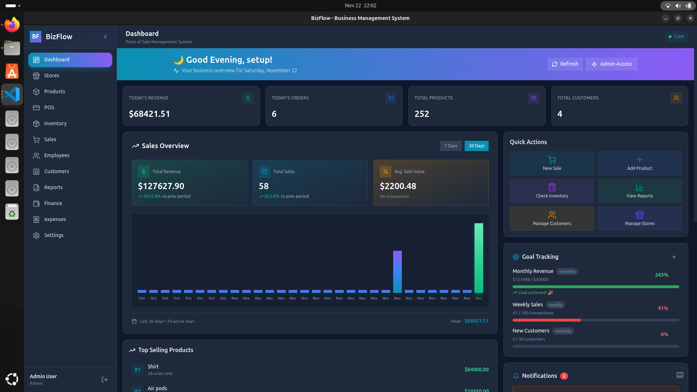
*Real-time business metrics with revenue tracking, sales analytics, and quick insights at a glance*

---

### 💰 Point of Sale (POS)
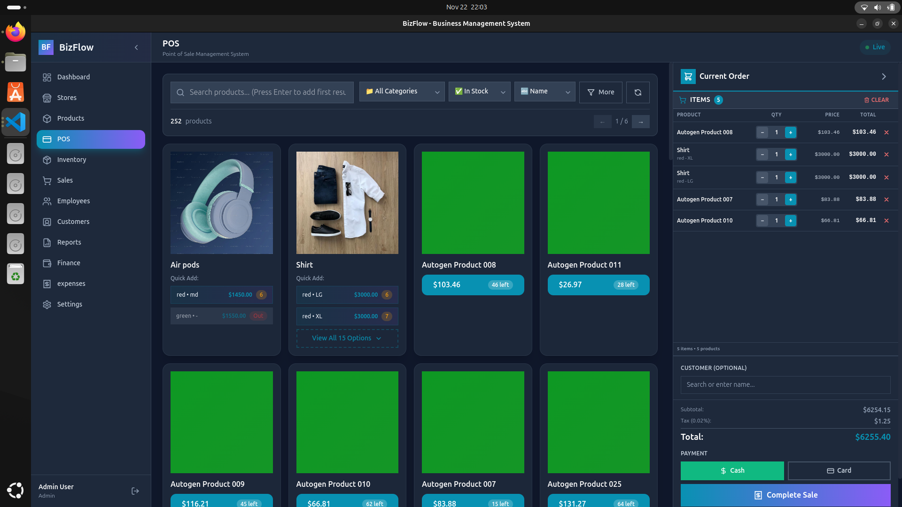
*Fast, professional checkout interface with product search, shopping cart, and quick payment options*

---

### 🛍️ Product Variants in POS

*Select product variants (colors, sizes) directly in POS with stock visibility and pricing*

---

### ✨ Add New Product
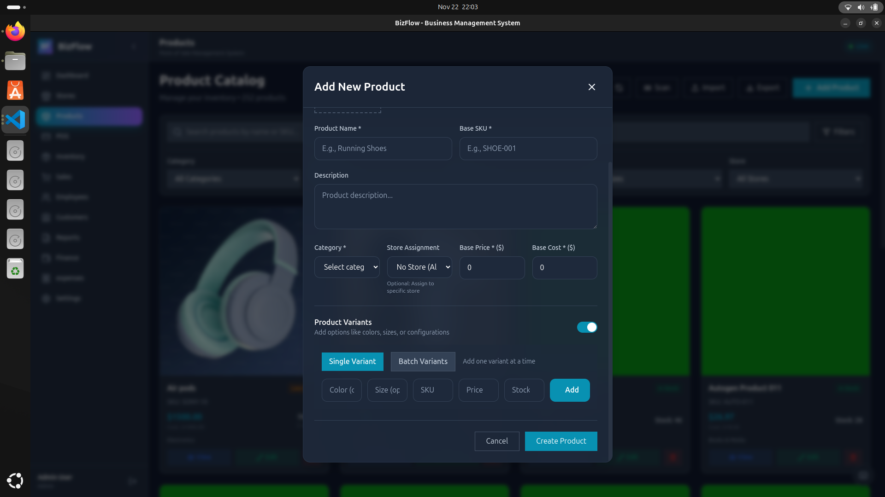
*Create products with multiple variants, images, categories, and pricing configurations*

---

### 📦 Product Catalog
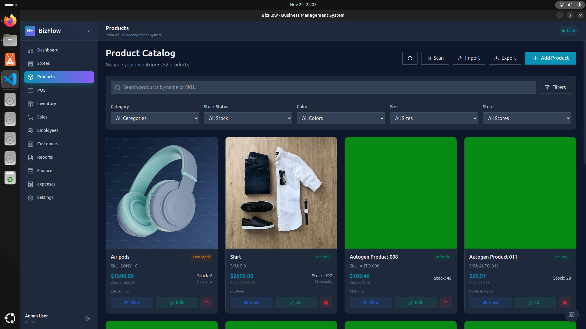
*Comprehensive product catalog with advanced filtering by category, color, size, and store*

---

### 💵 Price Calculator

*Smart pricing calculator with tax computation and profit margin analysis*

---

### 📊 Sales History
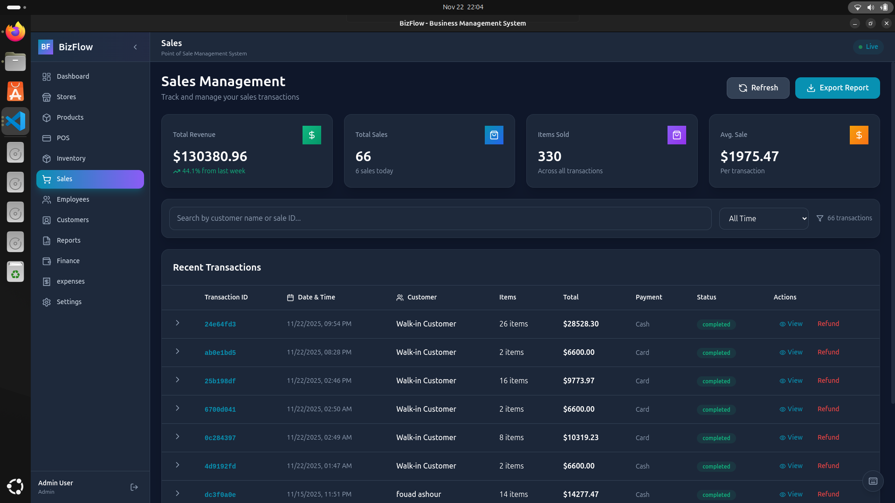
*Complete sales transaction history with payment methods, customer info, and order details*

---

### 🏦 Finance Dashboard
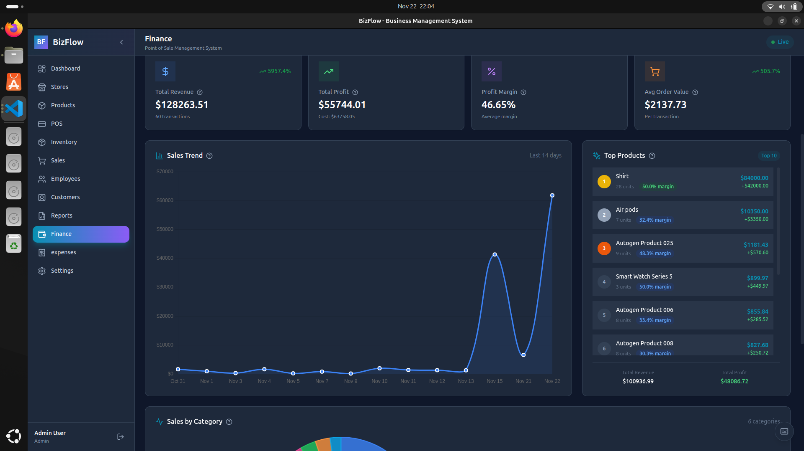
*Financial analytics with revenue, expenses, profit tracking, and performance charts*

---

### 💸 Expense Management

*Track business expenses with categories, dates, and detailed descriptions*

---

### 📋 Inventory Tracking
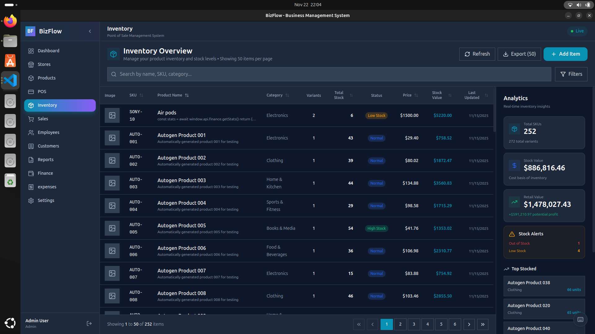
*Real-time inventory monitoring with stock levels, low stock alerts, and product movement*

---

### 📈 Report Generation
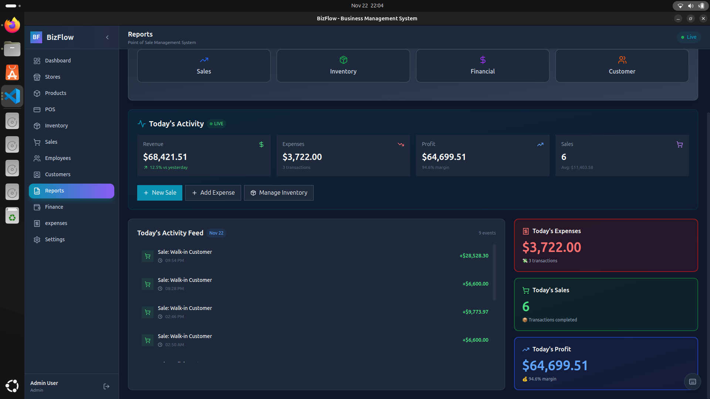
*Generate comprehensive business reports: sales, inventory, financial, and customer analytics*

---

### 📄 View Generated Reports
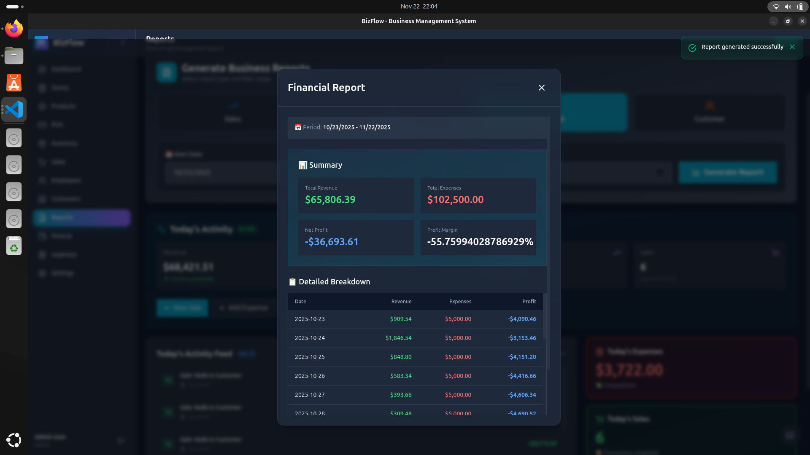
*Preview and export reports in PDF or CSV format with customizable date ranges*

---

### 🔐 Secure Login
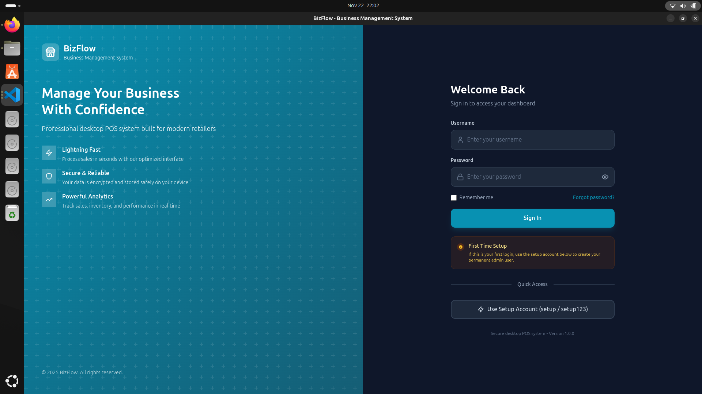
*Modern login interface with secure authentication and role-based access control*

---

### 👥 Customer Profile
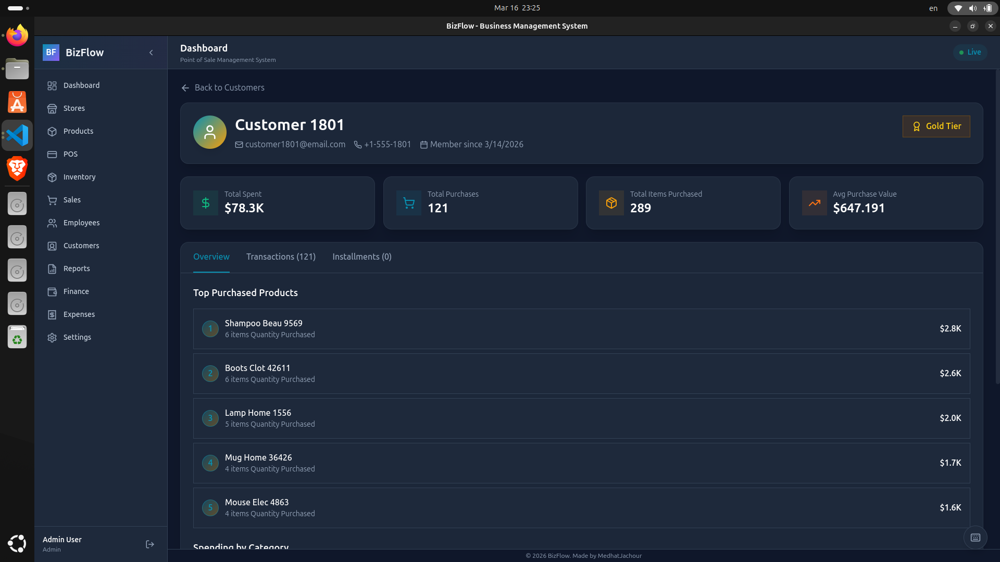
*Detailed customer profiles with purchase history, loyalty tier, outstanding balance, and contact info*

---

### 👨‍💼 Employee Profile

*Employee records with role assignment, salary details, and activity history*

---

### 🗂️ Employees Page

*Full employee directory with filtering by role, department, and status*

---

### 🥐 Bakery Management
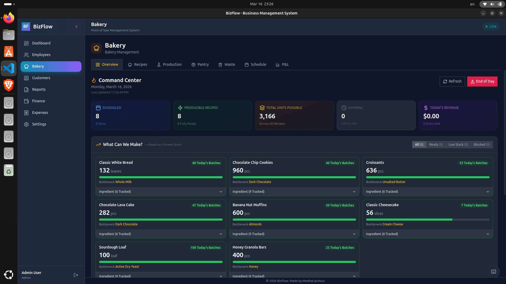
*Bakery production planning with daily schedules, product batches, and sales integration*

---

### 🏭 Bakery Production
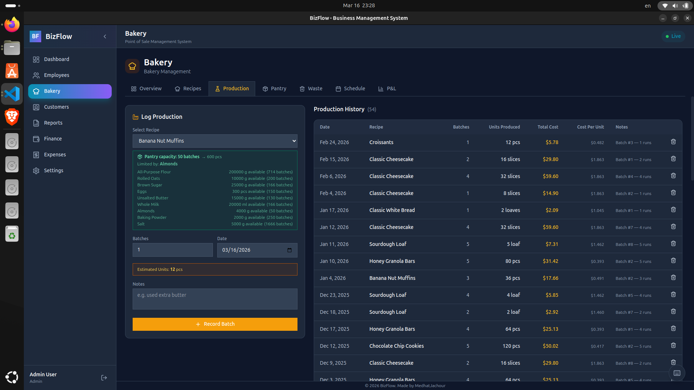
*Track raw material consumption, production batches, yield, and waste per product*

---

### 📜 Recipes
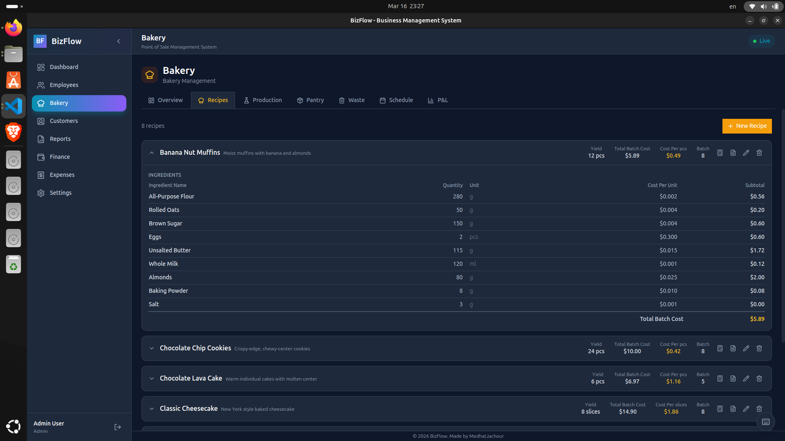
*Manage ingredient recipes with quantities, units, and cost calculations per batch*

---

### 🍽️ Restaurant
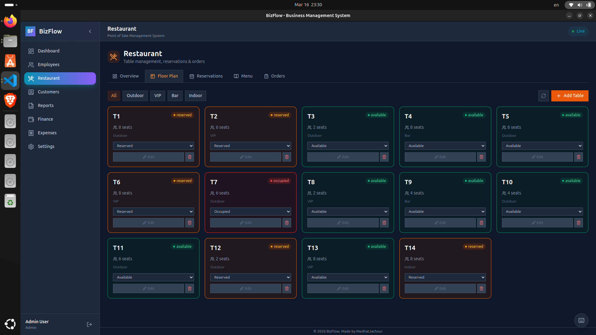
*Table management, live order tracking, and kitchen queue for restaurant operations*

---

### 🧾 Restaurant Menu

*Interactive menu management with categories, prices, and availability toggles*

---

### 🏥 Clinic
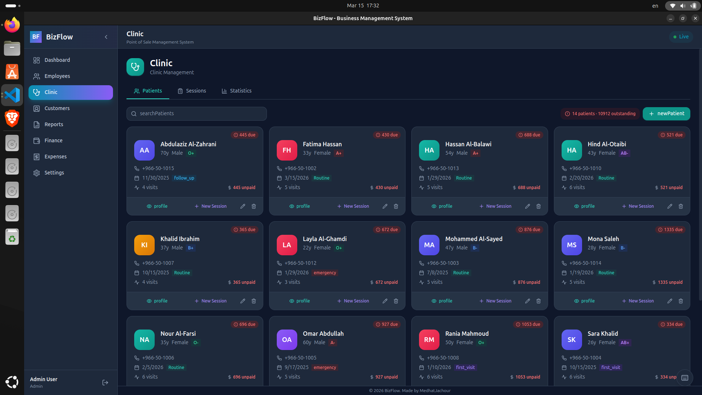
*Clinic dashboard with appointment queue, patient stats, and daily revenue summary*

---

### 🧑‍⚕️ Patient Page

*Patient record with medical history, session log, and billing overview*

---

### 💊 Patient Session

*Session details with diagnosis, prescriptions, check results, and session fee*

</div>

---

## ✨ What it does

BizFlow is an all-in-one desktop POS and business management system. Business data runs locally in SQLite, so daily work does not depend on a cloud server. Online services are used for website demos, customer accounts, downloads, support, and signed license activation.

### Core features

- **Point of Sale** — fast checkout with barcode scanning, product variants, and cart management
- **Inventory** — real-time stock tracking, low-stock alerts, and reorder suggestions
- **Products** — full catalog with variants (color, size), images, categories, and pricing
- **Sales history** — every transaction logged with payment method, customer, and receipt
- **Finance** — revenue, expenses, profit/loss tracking with charts
- **Reports** — export to PDF or CSV (sales, inventory, finance, customer analytics)
- **Customers** — database with loyalty tiers and purchase history
- **Employees** — records, roles, and salary tracking
- **Multi-store** — manage multiple store locations
- **Bilingual** — full Arabic and English UI with RTL support
- **License activation** — customer-specific license keys with signed activation certificates and device binding
- **Backups** — local database backups with restore support

### Search-friendly use cases

- Offline POS software for retail stores
- Restaurant management software with tables and reservations
- Bakery production and recipe management software
- Clinic and patient record management software
- Pharmacy POS with batch and expiry tracking
- Warehouse inventory and stock transfer software
- Gym membership and subscription management software
- One-time payment business management software

---

## 🧩 Microkernel / Plugin Architecture

BizFlow is built on a **microkernel** design — the core app is lean and stable, and business-specific features are loaded as isolated plugins. Nine business verticals ship today:

| Plugin | Status | What it adds |
|--------|--------|-------------|
| 🛒 **Commerce** | ✅ Active | Products & variants, inventory, Point of Sale, sales history & refunds, multi-store, suppliers, purchase orders, installments |
| 🥐 **Bakery** | ✅ Active | Recipe management, production batches, pantry stock, waste tracking, scheduling, P&L |
| 🍽️ **Restaurant** | ✅ Active | Table management, reservations, dine-in orders, menu management |
| 🏭 **Warehouse** | ✅ Active | Multi-location inventory, bin/location tracking, stock transfers, transfer audit trail |
| 🏥 **Clinic** | ✅ Active | Multi-doctor (profiles, live status board, default doctor), patient records, session tracking, prescriptions, check results (PDF), materials/inventory, financial stats |
| 🐾 **Vet Clinic** | ✅ Active | Pet patients with owner records, vet sessions, medicine inventory (batches/FEFO), appointments, clinical stats |
| 🏋️ **Gym** | ✅ Active | Coaches, trainees, subscription plans with freeze, walk-in sessions, financials |
| 💊 **Pharmacy** | ✅ Active | Medicine catalogue, batch & expiry tracking (FEFO), POS, refunds, suppliers & purchase orders |
| ☕ **Coffee Shop** | ✅ Active | Fast POS, tables, incoming and transit stock receipts, shifts, customers, reports, finance |

Plugins can be **enabled or disabled** from Settings → Modules. When a plugin is off, its pages and database tables are completely inactive. Each plugin is fully self-contained — its backend logic, UI pages, IPC bridge, and database schema all live inside `src/plugins/<name>/`.

### Plugin reference

The tables below describe the shipped UI and backend surface. IPC functions are grouped by their public channel namespace; function lists are representative operational calls, not an alternative public API contract. The source of truth is the plugin handler code, route pages, and `src/shared/permissions.ts`.

| Plugin | Tabs and pages | Operations and representative functions | Features |
| --- | --- | --- | --- |
| **Commerce** | POS, Quick Sale, Products, Inventory, Sales, Customers, Stores, Installments, Expenses | `products`: catalog, variants, search, create/update/delete, bulk edits; `sales`: create, history, refund, daily summary; `inventory`: metrics, low/out-of-stock, barcode search, adjustments; `categories`, `stores`, `suppliers`, `purchase-orders`, `stock-movements`, `deposits`, `installments`, `receipts`, `barcode` | Retail POS; barcode and variant selling; inventory and reorder visibility; customer credit; deposits and installments; suppliers, purchasing, refunds, receipts, reports. |
| **Bakery** | Overview, Recipes, Production, Sales, Pantry, Waste, Schedule, Profit & Loss, Expenses | `bakery`: recipe CRUD; production-batch creation/history; sales and summaries; pantry upsert, adjustment, bulk restock; waste logs and summary; schedule CRUD and completion; analytics and expenses | Ingredient-costed recipes; production batches with expiry; pantry thresholds; waste tracking; schedules that create batches; sales linked to batches; profit/loss analytics. |
| **Restaurant** | Overview, Tables, Menu, Orders/POS, Kitchen Display System, Reservations, Inventory, Recipes, Shifts, Sales, Waste | `restaurant`: table CRUD, positioning, transfer and merge; menu items, modifiers and 86 toggle; open orders, items, courses, split checks, discount, payment and close; KDS ticket/item bump; shifts and Z-report; ingredients, recipes, waste, reservations | Visual floor plan; dine-in ordering; course firing; KDS; check splitting; modifiers; reservations; inventory/BOM; 86 availability; shift cash reconciliation; real-time floor events. |
| **Warehouse** | Overview, Operations Board, Locations, Inventory, Transfers | `warehouse`: location CRUD; stock upsert, adjustment, low-stock and movement/audit queries; transfer CRUD and status changes; order creation, stage advancement, processing and journey board; overview | Zone/aisle/shelf/bin hierarchy; location-level stock; lot, batch, serial and expiry fields; quarantine/damage flags; transfers; inbound/outbound journey board; movement audit trail. |
| **Clinic** | Patients, Sessions, Statistics, Appointments, Follow-ups, Doctors, Materials, Expenses | `clinic:patients`, `clinic:sessions`, `clinic:appointments`, `clinic:checkResults`, `clinic:stats`, `clinic:expenses`, `clinic:staff`, `clinic:doctors`, `clinic:materials`: list, search, create/update/delete and domain summaries | Patient folders; clinical sessions, vitals and dental chart; prescriptions; lab/check-result files; appointments and reminders; doctor profiles and salary records; materials inventory; clinic financial statistics. |
| **Vet Clinic** | Owners, Patients, Sessions, Appointments, Follow-ups, Medicines, Sales, Sales History, Staff, Statistics, Expenses | `vet:owners`, `vet:patients`, `vet:sessions`, `vet:appointments`, `vet:checkResults`, `vet:expenses`, `vet:staff`, `vet:stats`, `vet:medicines`, `vet:catalogue`, `vet:visitTypes`, `vet:reports` | Owner and pet records; species, breed, microchip and weight data; clinical visits; prescription lifecycle; conflict-checked appointments; follow-ups; medicine catalogue; visit and owner settlement; staff payroll and reports. |
| **Gym** | Attendance, Trainees, Coaches, Plans, Subscriptions, Walk-ins, Lockers, Programs | `gym:coaches`, `gym:trainees`, `gym:plans`, `gym:subscriptions`, `gym:sessions`, `gym:expenses`, `gym:stats`, `gym:alerts`, `gym:measurements`, `gym:goals`, `gym:shifts`, `gym:lockers`, `gym:programs` | Membership plans and amenities; subscriptions with freeze/unfreeze; attendance and walk-ins; coach sessions; trainee measurements and goals; expiry alerts; lockers; training program assignment; revenue and churn metrics. |
| **Pharmacy** | Dashboard, POS, Products, Inventory, Sales, Customers, Suppliers, Purchase Orders, Reports | `pharmacy:products`, `pharmacy:batches`, `pharmacy:sales`, `pharmacy:suppliers`, `pharmacy:purchaseOrders`, `pharmacy:stats`, `pharmacy:customers`: CRUD, sale/payment/refund, batch adjustment/disposal, receiving, settlement and analytics | Medicine and generic-name catalogue; FEFO batch/expiry control; base and sub-unit selling; POS; expiry alerts and disposal; suppliers and receiving; customer credit; sales refunds and inventory analytics. |
| **Coffee Shop** | POS, Tables, Products, Inventory, Incoming Stock, Transit Stock, Expenses, Sales, Shifts, Customers, Reports, Finance | `coffee:categories`, `coffee:products`, `coffee:inventory`, `coffee:incomingReceipts`, `coffee:transitReceipts`, `coffee:expenses`, `coffee:tables`, `coffee:orders`, `coffee:sales`, `coffee:shifts`, `coffee:customers`, `coffee:reports`, `coffee:finance` | One-click POS; dine-in, takeaway and delivery orders; table history; product images and availability; simple stock movements; supplier and inter-location receipts; optional-restock refunds; cash reconciliation; daily analytics. |

### Permissions by plugin

Settings → Users → **Plugin Role Permissions** presents the pages below as a permission matrix. `access_*` grants entry to a plugin; shared capabilities protect sensitive data and operations across plugins. Admin is always full access. Plugin roles are assigned per user and can be customised.

| Plugin | Page capability gates | Sensitive action gates | Default plugin roles |
| --- | --- | --- | --- |
| **Commerce** | POS/Quick Sale/Sales/Installments: `access_commerce`; Products/Inventory: `manage_inventory`; Customers: `manage_customers`; Stores: `manage_settings`; Expenses: `view_finance` | `give_discount`, `issue_refund`, `void_sale` | `sales`, `inventory`, `finance` |
| **Bakery** | Overview/Sales: `access_bakery`; Recipes/Production/Pantry/Waste/Schedule: `manage_inventory`; P&L: `view_profit`; Expenses: `view_finance` | Shared inventory protection | `bakery_staff` |
| **Restaurant** | Overview/Tables/Orders: `access_restaurant`; Reservations: `manage_customers`; Menu: `manage_inventory` | `give_discount`, `void_sale` | `restaurant_staff` |
| **Warehouse** | Overview/Operations: `access_warehouse`; Locations/Inventory/Transfers: `manage_inventory` | Shared inventory protection | `warehouse_staff` |
| **Clinic** | Patients/Sessions: `access_clinic`; Appointments/Follow-ups: `manage_customers`; Doctors: `manage_staff`; Materials: `manage_inventory`; Stats/Expenses: `view_finance` | Shared data and inventory protection | `clinic_staff` |
| **Vet Clinic** | Owners/Sessions/Sales/Sales History: `access_vet`; Appointments/Follow-ups: `manage_customers`; Vets: `manage_staff`; Medicines: `manage_inventory`; Stats/Expenses: `view_finance` | `issue_refund` | `vet_staff` |
| **Gym** | Attendance/Trainees/Walk-ins: `access_gym`; Coaches: `manage_staff`; Subscriptions: `manage_customers`; Plans/Lockers/Programs: `manage_settings` | Shared customer and staff protection | `gym_staff` |
| **Pharmacy** | Dashboard/POS/Sales: `access_pharmacy`; Products/Inventory: `manage_inventory`; Customers: `manage_customers`; Suppliers/Orders: `manage_purchasing`; Reports: `view_finance` | `give_discount`, `issue_refund` | `pharmacy_staff` |
| **Coffee Shop** | Each page has its own capability: `coffee_pos`, `coffee_tables`, `coffee_products`, `coffee_inventory`, `coffee_incoming`, `coffee_expenses`, `coffee_sales`, `coffee_shifts`, `coffee_customers`, `coffee_reports`, `coffee_finance` | `give_discount`, `issue_refund`, `void_sale` | `coffee_cashier`, `coffee_inventory_manager`, `coffee_shift_manager`, `coffee_manager` |

Shared capabilities are `view_profit`, `view_finance`, `manage_inventory`, `manage_purchasing`, `manage_customers`, `manage_staff`, `manage_users`, `manage_settings`, and `export_data`. The main-process permission guard also blocks plugin IPC namespaces and refund/return/void channels after a user session is bound.

---

## 🚀 Getting Started

### Requirements

- **Node.js** 18+ 
- **npm** 9+

### Install & run

```bash
git clone https://github.com/medhatjachour/BizFlow.git
cd BizFlow/apps/Bizflow
npm install
npm run dev
```

On first run the app creates and seeds a local SQLite database automatically.

### Default login

| Username | Password | Role |
|----------|----------|------|
| `setup` | `setup123` | Admin |

> Change the default password after first login.

### Build for production

```bash
npm run build:win    # Windows .exe
npm run build:mac    # macOS .dmg
npm run build:linux  # Linux .AppImage / .deb
```

---

## 🔒 Security

- All data stored locally — nothing leaves your machine
- Passwords hashed with bcrypt
- Renderer process sandboxed (no direct Node.js access)
- IPC-only communication between UI and backend
- Signed license activation certificates verified with an embedded public key
- One-device license binding with online revocation checks for packaged builds

---

## 🏗️ Architecture & Design

### Software Architecture

BizFlow combines two architectural styles:

**Electron Three-Process Model**
```
┌─────────────────────────────────────────────────────┐
│  Main Process  (Node.js)                            │
│  • Database (Prisma + SQLite)                       │
│  • Business logic (Services)                        │
│  • IPC handler registry                             │
│  • Plugin handler registration                      │
└──────────────────┬──────────────────────────────────┘
                   │  IPC (contextBridge)
┌──────────────────┴──────────────────────────────────┐
│  Preload Script  (secure bridge)                    │
│  • Exposes window.api.* to renderer                 │
│  • Each plugin registers its own API namespace      │
└──────────────────┬──────────────────────────────────┘
                   │  window.api.*
┌──────────────────┴──────────────────────────────────┐
│  Renderer Process  (React)                          │
│  • UI pages & components                            │
│  • Plugin pages (lazy loaded)                       │
│  • No direct DB or Node.js access                   │
└─────────────────────────────────────────────────────┘
```

**Microkernel (Plugin System)**

The core app handles authentication, employees, customers, finance dashboards, and reporting. Business-vertical features — commerce/retail, bakery, restaurant, warehouse, clinic, vet, gym, and pharmacy — are self-contained plugins loaded on top. Each plugin is completely isolated — removing one has zero impact on the rest.

```
src/plugins/<name>/
  index.ts            ← IPlugin export { id, ensureSchema, registerHandlers }
  handlers/           ← backend IPC handlers (split by domain)
    index.ts          ← registers all plugin handlers
    <entity>.ts       ← per-entity handler file
  preload.ts          ← window.api.<name>.* bindings
  migrate.ts          ← ensures plugin tables exist at runtime
  schema.prisma       ← plugin's own Prisma models

src/renderer/src/plugins/<name>/pages/
  index.tsx           ← main list / overview page
  components/         ← all UI components for this plugin
```

> Plugin identity/route/model metadata is centralized in `src/shared/modules.ts` (`MODULE_REGISTRY`), not a per-plugin manifest file.

Schemas are merged at build time: `scripts/merge-schemas.js` combines `prisma/schema.prisma` + every enabled plugin's `schema.prisma` → `prisma/merged.prisma`.

---

### Design Patterns

| Pattern | Where used | Purpose |
|---------|-----------|---------|
| **Repository** | `src/main/repositories/` | Abstracts data access — `ProductRepository`, `SupplierRepository`, `PurchaseOrderRepository` |
| **Service Layer** | `src/main/services/` | Business logic separated from DB and transport — `InventoryService`, `InstallmentService`, `ReorderAnalysisService`, etc. |
| **Handler Registry** | `src/main/ipc/handlers/index.ts` | Central file registers all IPC handlers at startup; each domain has its own handler file |
| **Mapper** | `src/shared/mappers/` | Converts between Prisma entities and DTOs — `ProductMapper`, `SupplierMapper` |
| **DTO** | `src/shared/dtos/` | Typed data shapes for IPC transport — `product.dto.ts`, `supplier.dto.ts` |
| **Context Provider** | `src/renderer/src/contexts/` | Global React state — auth, theme, language, toast notifications |
| **Custom Hook** | every page module | Isolates data-fetching and business logic from JSX — `useProducts`, `usePOS`, `useFinance`, etc. |
| **Observer / Event Bus** | `src/shared/events/EventBus.ts` | Decoupled cross-process events |
| **Lazy Loading** | `App.tsx` | Every page is a `React.lazy()` import — only loads when navigated to |
| **Validation Schema** | `src/shared/validation/` | Zod-style schemas for all entity inputs — `product.schema.ts`, `sale.schema.ts`, etc. |
| **Authorization Middleware** | `src/main/middleware/authz.ts` | Role checks applied before IPC handlers execute |
| **Cache-Aside** | `src/main/services/CacheService.ts` | In-memory TTL cache for expensive queries (product stats, dashboard metrics) |

---

### Folder Structure

```
BizFlow/
├── prisma/
│   ├── schema.prisma           # Core database schema
│   ├── merged.prisma           # Auto-generated (core + plugins) — gitignored
│   ├── dev.db                  # Development SQLite database
│   └── template.db             # Pre-seeded template for production first-run
│
├── scripts/
│   └── merge-schemas.js        # Combines core + plugin schemas at build time
│
├── src/
│   ├── main/                   # Electron main process (Node.js)
│   │   ├── index.ts            # App entry — window, lifecycle, handler bootstrap
│   │   ├── database/
│   │   │   ├── init.ts         # DB init: dev uses dev.db, prod copies template
│   │   │   ├── optimization.ts # SQLite pragmas, index creation, ANALYZE
│   │   │   └── seed-production.ts
│   │   ├── ipc/
│   │   │   └── handlers/
│   │   │       ├── index.ts              # Registers ALL handlers at startup
│   │   │       ├── auth.handlers.ts
│   │   │       ├── products.handlers.ts
│   │   │       ├── sales.handlers.ts
│   │   │       ├── sale-transactions.handlers.ts
│   │   │       ├── inventory.handlers.ts
│   │   │       ├── finance.handlers.ts
│   │   │       ├── dashboard.handlers.ts
│   │   │       ├── customers.handlers.ts
│   │   │       ├── employees.handlers.ts
│   │   │       ├── stores.handlers.ts
│   │   │       ├── categories.handlers.ts
│   │   │       ├── reports.handlers.ts
│   │   │       ├── analytics.handlers.ts
│   │   │       ├── search.handlers.ts
│   │   │       ├── user.handlers.ts
│   │   │       ├── deposits.handlers.ts
│   │   │       ├── installments.handlers.ts
│   │   │       ├── receipts.handlers.ts
│   │   │       ├── receipt.handlers.ts   # Thermal printer receipts
│   │   │       ├── barcode.handlers.ts
│   │   │       ├── backup.handlers.ts
│   │   │       ├── reorder.handlers.ts
│   │   │       ├── suppliers.handlers.ts
│   │   │       ├── purchase-orders.handlers.ts
│   │   │       ├── stock-movements.handlers.ts
│   │   │       ├── delete.handlers.ts
│   │   │       ├── email.handlers.ts
│   │   │       ├── log.handlers.ts
│   │   │       └── module.handlers.ts    # Plugin enable/disable IPC
│   │   ├── middleware/
│   │   │   └── authz.ts                  # Role-based authorization
│   │   ├── repositories/                 # Repository pattern — data access layer
│   │   │   ├── ProductRepository.ts
│   │   │   ├── SupplierRepository.ts
│   │   │   └── PurchaseOrderRepository.ts
│   │   ├── services/                     # Service layer — business logic
│   │   │   ├── CacheService.ts
│   │   │   ├── InventoryService.ts
│   │   │   ├── ProductService.ts
│   │   │   ├── DeleteService.ts
│   │   │   ├── DepositService.ts
│   │   │   ├── InstallmentService.ts
│   │   │   ├── InstallmentPlanService.ts
│   │   │   ├── ReceiptService.ts
│   │   │   ├── ReorderAnalysisService.ts
│   │   │   ├── PurchaseOrderService.ts
│   │   │   ├── SupplierService.ts
│   │   │   ├── StoreAnalyticsService.ts
│   │   │   ├── EmailReportService.ts
│   │   │   ├── ImageService.ts
│   │   │   ├── ThermalPrinterService.ts
│   │   │   ├── PredictionService.ts
│   │   │   └── MigrationManager.ts
│   │   └── utils/
│   │       ├── logger.ts                 # Structured logger (electron-log)
│   │       └── module-settings.ts        # Plugin enable/disable persistence
│   │
│   ├── plugins/                          # ── Microkernel plugin layer (backend) ── (8 plugins)
│   │   ├── commerce/                     # Retail core: products, POS, sales, inventory, suppliers
│   │   │   ├── index.ts                  # IPlugin export { id, ensureSchema, registerHandlers }
│   │   │   ├── handlers/                 # IPC handlers split by domain
│   │   │   ├── preload.ts                # window.api.commerce.* bindings
│   │   │   ├── migrate.ts                # Ensures tables exist at runtime
│   │   │   └── schema.prisma             # Plugin's Prisma models
│   │   ├── bakery/                       # Bakery plugin (self-contained)
│   │   │   ├── index.ts
│   │   │   ├── handlers/                 # recipes, production, pantry, schedule, waste, analytics
│   │   │   ├── preload.ts                # window.api.bakery.* bindings
│   │   │   ├── migrate.ts
│   │   │   └── schema.prisma
│   │   ├── restaurant/                   # menu, orders, tables, reservations, overview
│   │   │   └── … (index.ts, handlers/, preload.ts, migrate.ts, schema.prisma)
│   │   ├── warehouse/                    # stock, locations, transfers, overview
│   │   │   └── … (index.ts, handlers/, preload.ts, migrate.ts, schema.prisma)
│   │   ├── clinic/                       # patients, sessions, checkResults, appointments, materials, staff, stats
│   │   │   └── … (index.ts, handlers/, preload.ts, migrate.ts, schema.prisma)
│   │   ├── vet/                          # owners, patients, medicines (batches/FEFO), sessions, appointments, stats
│   │   │   └── … (index.ts, handlers/, preload.ts, migrate.ts, schema.prisma)
│   │   ├── gym/                          # coaches, trainees, subscriptions, walk-ins, expenses
│   │   │   └── … (index.ts, handlers/, preload.ts, migrate.ts, schema.prisma)
│   │   └── pharmacy/                     # products, batches, sales (FEFO), suppliers, purchase orders, stats
│   │       └── … (index.ts, handlers/, preload.ts, migrate.ts, schema.prisma)
│   │
│   ├── preload/
│   │   ├── index.ts                      # contextBridge — exposes window.api.*
│   │   └── index.d.ts                    # TypeScript types for window.api
│   │
│   ├── renderer/                         # React application
│   │   └── src/
│   │       ├── App.tsx                   # Router — all routes, lazy imports
│   │       ├── contexts/                 # Global state (Context Provider pattern)
│   │       │   ├── AuthContext.tsx
│   │       │   ├── ThemeContext.tsx
│   │       │   ├── LanguageContext.tsx
│   │       │   └── ToastContext.tsx
│   │       ├── hooks/                    # Shared custom hooks
│   │       │   ├── useModuleEnabled.ts   # Plugin feature-flag hook
│   │       │   └── ...
│   │       ├── components/
│   │       │   ├── layout/               # RootLayout, sidebar, header
│   │       │   └── ui/                   # Shared UI primitives
│   │       ├── pages/                    # Core feature pages
│   │       │   ├── Dashboard/
│   │       │   ├── POS/
│   │       │   ├── Products/
│   │       │   ├── Sales/
│   │       │   ├── Finance/
│   │       │   ├── Inventory/
│   │       │   ├── Customers/
│   │       │   ├── Employees/
│   │       │   ├── Expenses/
│   │       │   ├── Reports/
│   │       │   └── Settings/
│   │       ├── plugins/                  # Plugin UI (mirrors src/plugins/)
│   │       │   ├── commerce/             # POS, Products, Inventory, Sales pages
│   │       │   ├── bakery/
│   │       │   │   └── pages/            # Bakery pages & components
│   │       │   ├── restaurant/
│   │       │   │   └── pages/            # Restaurant pages & components
│   │       │   ├── warehouse/
│   │       │   │   └── pages/            # Warehouse pages & components
│   │       │   ├── clinic/
│   │       │   │   └── pages/            # Patient list, PatientProfile, session modals
│   │       │   ├── vet/
│   │       │   │   └── pages/            # Vet patients, owners, medicines, sessions
│   │       │   ├── gym/
│   │       │   │   └── pages/            # Coaches, trainees, subscriptions
│   │       │   └── pharmacy/
│   │       │       └── pages/            # Catalogue, POS, batches, purchase orders
│   │       ├── i18n/
│   │       │   └── translations.ts       # EN + AR strings (bilingual)
│   │       └── services/                 # Frontend-side helpers
│   │
│   └── shared/                           # Code shared by main + renderer
│       ├── modules.ts                    # Plugin registry & ModuleId types
│       ├── types.ts                      # Common type definitions
│       ├── dtos/                         # Data Transfer Objects
│       ├── mappers/                      # Entity ↔ DTO mappers
│       ├── interfaces/                   # IRepository, IService contracts
│       ├── events/EventBus.ts            # Cross-process event bus
│       └── validation/                   # Input validation schemas
```

---

## 📄 License

MIT © [medhatjachour](https://github.com/medhatjachour)

</div>

