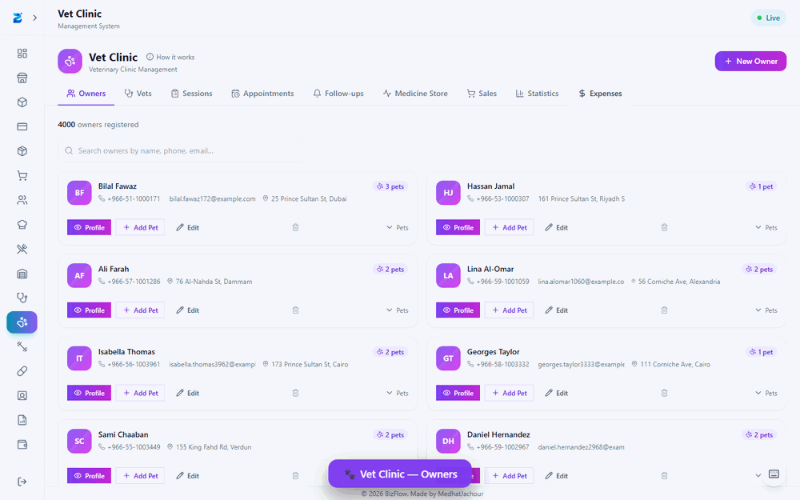
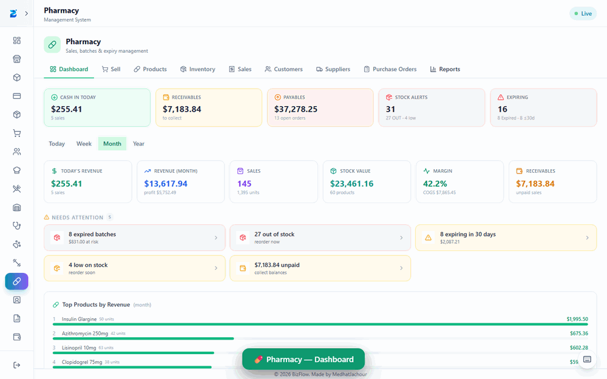
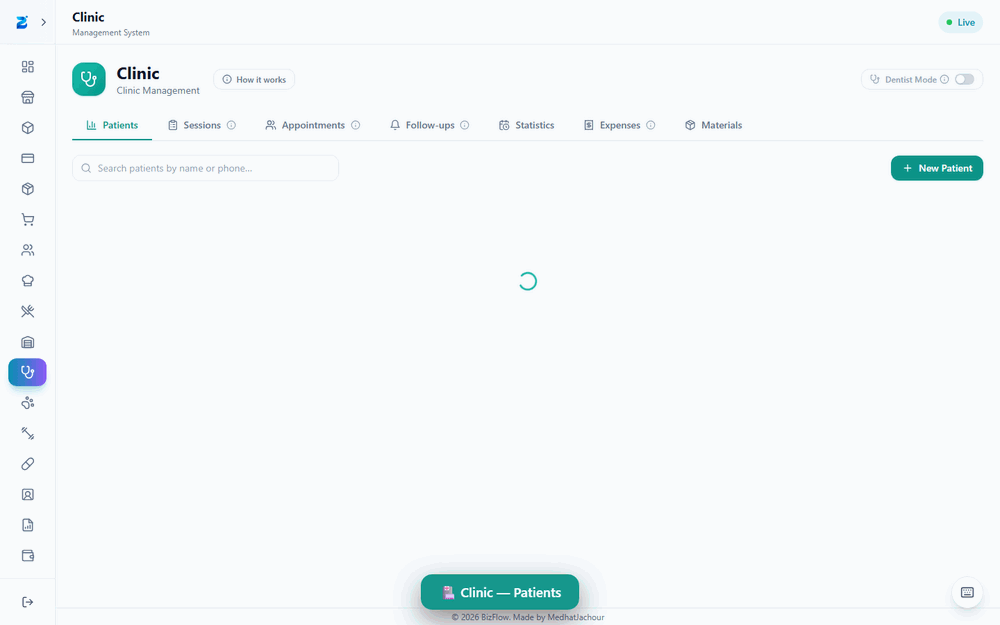
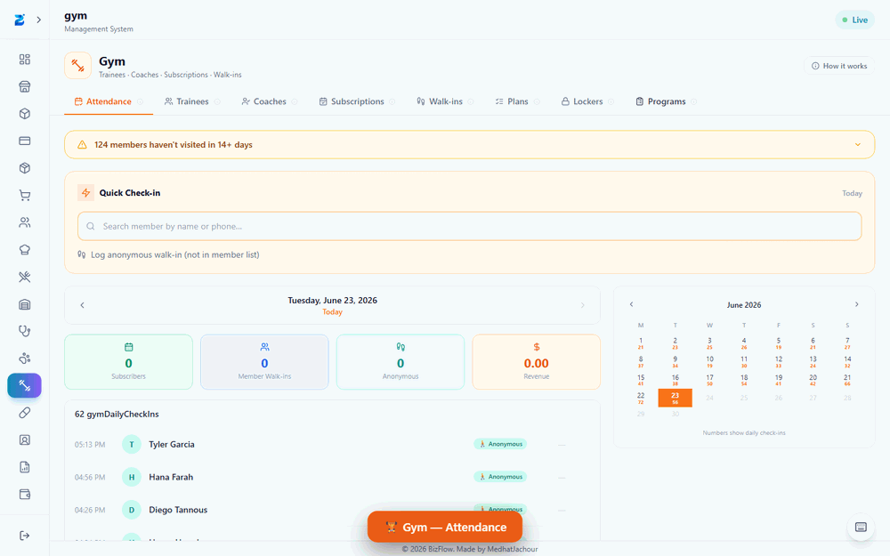
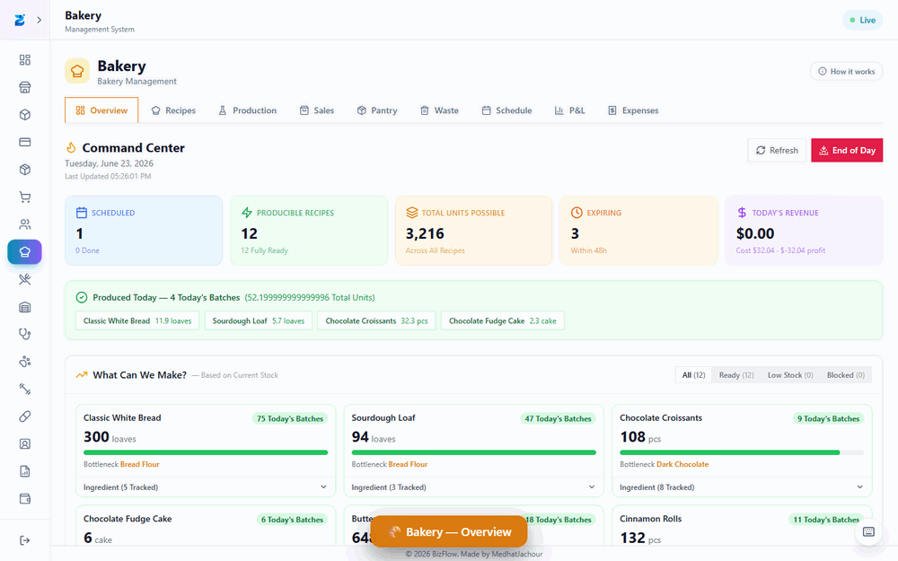
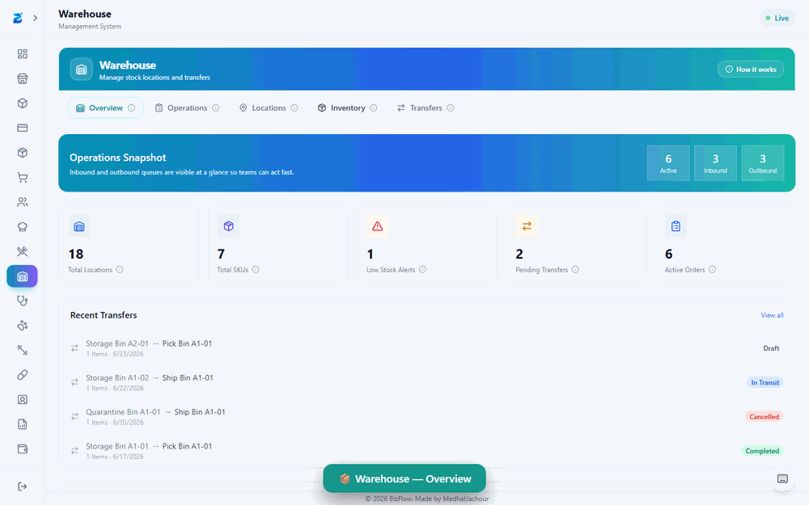
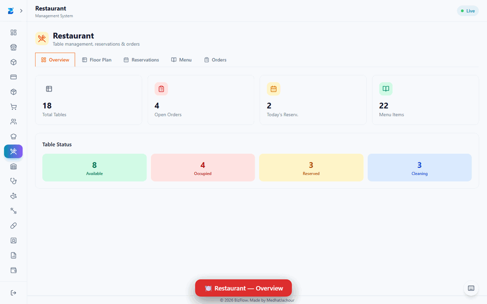
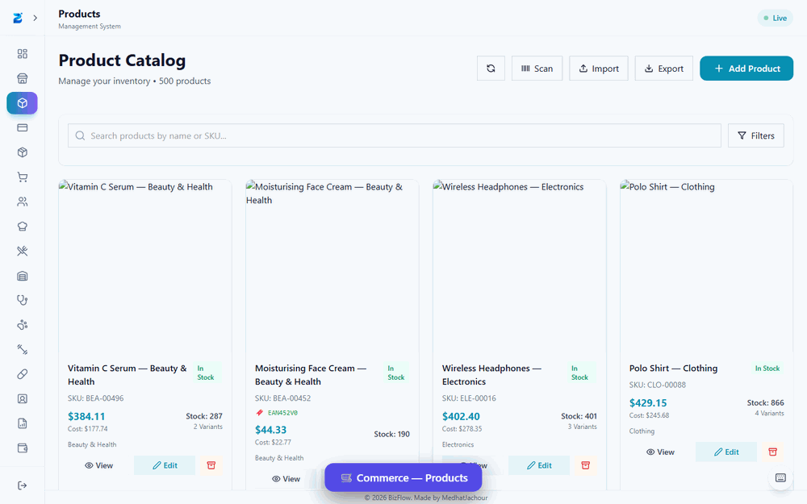

# BizFlow — Feature Tours

Animated tours of every plugin, walking through each feature/tab one screen at a
time. Captured from the live web build and saved as looping GIFs.

> Regenerate the GIFs from captured frames with: `node scripts/encode-tours.mjs [plugin…]`

| Plugin | Tour | Features covered |
| --- | --- | --- |
| 🛒 **Commerce** | [commerce.gif](commerce.gif) | Products, Sales / POS, Inventory, Finance, Reports |
| 🥐 **Bakery** | [bakery.gif](bakery.gif) | Overview, Recipes, Production, Sales, Pantry, Waste, Schedule, P&L, Expenses |
| 🍽️ **Restaurant** | [restaurant.gif](restaurant.gif) | Overview, Floor Plan, Reservations, Menu, Orders |
| 📦 **Warehouse** | [warehouse.gif](warehouse.gif) | Overview, Operations, Locations, Inventory, Transfers |
| 🏥 **Clinic** | [clinic.gif](clinic.gif) | Patients, Sessions, Appointments, Follow-ups, Statistics, Expenses, Materials |
| 🐾 **Vet Clinic** | [vet.gif](vet.gif) | Owners, Vets, Sessions, Appointments, Follow-ups, Medicine Store, Sales, Statistics, Expenses |
| 🏋️ **Gym** | [gym.gif](gym.gif) | Attendance, Trainees, Coaches, Subscriptions, Walk-ins, Plans, Lockers, Programs |
| 💊 **Pharmacy** | [pharmacy.gif](pharmacy.gif) | Dashboard, Sell, Products, Inventory, Sales, Customers, Suppliers, Purchase Orders, Reports |

## 🐾 Vet Clinic

## 💊 Pharmacy

## 🏥 Clinic

## 🏋️ Gym

## 🥐 Bakery

## 📦 Warehouse

## 🍽️ Restaurant

## 🛒 Commerce

---

### How these were made
1. **Seed every plugin** so screens show real data:
   `npm run prisma:seed:vet`, `:commerce`, `:bakery`, `:clinic`, `:pharmacy`, `:gym`,
   `:warehouse`, `:restaurant` (all write to the dev database).
2. **Run the browser build:** `npm run web:setup` once, then `npm run web:server` +
   `npm run web:client` (UI at <http://localhost:5180>, login `setup` / `setup123`).
   Restart `web:server` after seeding so it rebuilds its data template.
3. **Capture:** `npm run tours:capture` ([scripts/capture-tours.mjs](../../scripts/capture-tours.mjs))
   drives headless Chromium at 1440×900 — logs in, visits each plugin, clicks through every
   tab, overlays a caption banner and screenshots each feature into `.tour-frames/<plugin>/`.
4. **Encode:** `npm run tours:encode` ([scripts/encode-tours.mjs](../../scripts/encode-tours.mjs))
   builds one looping GIF per plugin (sharp resize + gifenc). Each feature screen shows ~1.7s.

> Pass plugin ids to do a subset, e.g. `npm run tours:capture -- vet pharmacy`.
