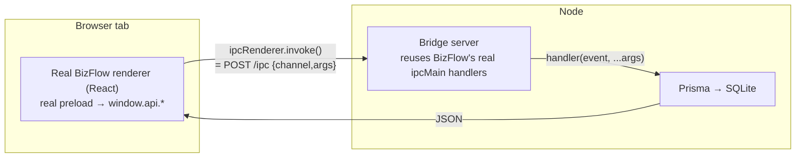

# BizFlow on the Web

This project takes **BizFlow** — a Windows **Electron + Prisma** desktop business
app — and makes it **run inside a normal browser tab**: no Electron, no Docker,
no streaming. It also ships a marketing site where visitors can **try any module
live, buy it, or request a custom one**.

The headline achievement: we run the *real* desktop app's code on the web by
swapping its transport (Electron IPC → HTTP) — **without rewriting any of its
business logic**.

> Deep dives:
> [docs/BIZFLOW-CHANGES.md](docs/BIZFLOW-CHANGES.md) ·
> [../bizflow/web/README.md](../bizflow/web/README.md) ·
> [docs/STRIPE-SETUP.md](docs/STRIPE-SETUP.md)

---

## How we run a desktop app on the web (the technique)

An Electron app is really two programs joined by a message channel:

- a **renderer** (the UI — Chromium/React), and
- a **main process** (the backend — Node.js, here with Prisma + SQLite),

talking over **IPC**: the UI calls `ipcRenderer.invoke(channel, …args)` and the
backend answers with `ipcMain.handle(channel, fn)`.

That single seam is the whole trick. We keep **both sides unchanged** and replace
the wire between them with **HTTP**:



- In the **browser**, an `electron` shim makes `ipcRenderer.invoke` do an HTTP
  `POST /ipc`. The app's real preload runs unmodified and builds the identical
  `window.api`, so every call keeps its exact shape.
- In **Node**, an `electron` shim records every `ipcMain.handle(channel, fn)`
  into a registry. A tiny **bridge server** receives `POST /ipc`, looks up the
  handler, runs it against the real Prisma/SQLite database, and returns JSON.
- **Vite** serves BizFlow's real renderer, aliasing Electron-only modules to the
  browser shims.

Result: the genuine app — login, dashboard, POS, all 7 business modules — runs
in a browser tab, backed by a real database. **Zero business logic rewritten.**

For the full file-by-file write-up see
[../bizflow/web/README.md](../bizflow/web/README.md).

---

## What's in this repo

Two workspaces work together (this folder is `apps/nebula`):

| Folder | Role |
| --- | --- |
| **`apps/bizflow/`** | The BizFlow desktop app (Electron, MIT). We added a `web/` adapter that runs it on the web. |
| **`apps/nebula/`** (this folder) | The marketing site + in-browser workspace where modules are tried, bought, or custom-requested. |

### Site / workspace (`nebula/`)

| Area | Path | Description |
| --- | --- | --- |
| Landing + module picker | `src/components/landing/*` | Hero, **Plugins** picker, Features, Showcase, **Pricing**, **RequestForm**, Footer |
| In-browser workspace | `src/app/app/page.tsx`, `src/components/desktop/*` | Windowed dock that embeds each module live |
| Module embed | `src/components/desktop/ModuleFrame.tsx` | Loads one BizFlow module (isolated) + a Download/Buy bar |
| Module catalog | `src/lib/plugins.ts` | One source of truth: names, features, prices, demo + download URLs |
| Pricing model | `src/lib/pricing.ts` | Shared estimate logic (form preview + server) |
| Payments | `src/lib/stripe.ts`, `src/lib/payments.ts`, `src/app/api/checkout`, `src/app/api/webhooks/stripe` | Stripe Checkout + webhook fulfillment |
| Requests | `src/app/api/requests/route.ts` | Custom-work intake with instant estimate |

### Web adapter (`apps/bizflow/web/`)

| File | Purpose |
| --- | --- |
| `shims/electron.browser.ts` | Browser `electron` shim — `ipcRenderer.invoke` → `POST /ipc` |
| `shims/electron.node.ts` | Node `electron` shim — records `ipcMain.handle` into a registry |
| `server.ts` | Bridge server: inits Prisma/SQLite, registers all module handlers, serves `/ipc` |
| `build-server.mjs` | esbuild bundler (aliases Electron → Node shims) that runs the server |
| `vite.web.config.ts` | Serves the real renderer with Electron aliased to browser shims |
| `main-web.tsx`, `index.html` | Web entry: runs the real preload, mounts the real `App` |

---

## User guide — run the desktop app on the web

You need **Node 18+** (the project was built on Node 22). Everything runs from
the **repo root** via npm workspaces. From a clean machine:

### Step 1 — Install all dependencies (from the repo root)

```bash
# skip downloading the Electron binary — the web port doesn't need it
set ELECTRON_SKIP_BINARY_DOWNLOAD=1   # PowerShell: $env:ELECTRON_SKIP_BINARY_DOWNLOAD=1
npm install
```

### Step 2 — Build the database + Prisma client

```bash
  delet 
[bridge]   web\.dist\server.cjs      972.1kb
[bridge]   web\.dist\server.cjs.map    1.9mb
# from the repo root: merges every module's schema, creates the SQLite
# template DB, and generates the Prisma client with all module models
npm run setup
```

> If you ever see *“Cannot read properties of undefined (reading 'findMany')”*,
> the Prisma client was generated without the module models — rerun the
> `prisma generate` line above (stop the bridge first if a file lock blocks it).

### Step 3 — Start everything (from the repo root)

```bash
npm run dev    # bridge :8787 + BizFlow UI :5180 + Nebula site :3000
```

Prefer separate terminals? Use `npm run dev:bridge`, `npm run dev:ui`, and
`npm run dev:site` individually (or `npm run dev:web` for just bridge + UI).

Open <http://localhost:5180> and log in with the seeded account:

| Username | Password |
| --- | --- |
| `setup` | `setup123` |

You're now running the real desktop app in your browser, with the Nebula site
at <http://localhost:3000>.

- **Try a module:** site → **Modules** → *Try free* opens
  `/app?module=<id>`, which embeds that module **in isolation**
  (only that module shows in the app's nav).
- **Buy:** the Buy / *Get the full suite* buttons start Stripe Checkout
  (falls back to the download link until Stripe keys are set —
  see [docs/STRIPE-SETUP.md](docs/STRIPE-SETUP.md)).
- **Request custom work:** the **Custom** section gives an instant price estimate
  and records the request.

### One-glance: the three processes

| Process | Root script | Port |
| --- | --- | --- |
| Bridge (backend) | `npm run dev:bridge` | 8787 |
| BizFlow UI | `npm run dev:ui` | 5180 |
| Site + workspace | `npm run dev:site` | 3000 |

---

## Configuration

Copy `.env.example` to `.env.local` and adjust as needed:

| Variable | Purpose |
| --- | --- |
| `NEXT_PUBLIC_BIZFLOW_URL` | Where the workspace embeds the live BizFlow app (default `http://localhost:5180/`) |
| `NEXT_PUBLIC_SITE_URL` | This site's origin (Stripe return URLs) |
| `GOOGLE_CLIENT_ID`, `GOOGLE_CLIENT_SECRET` | Optional Google Sign-In; configure the callback as `/api/account/google` at your site's exact public origin |
| `STRIPE_SECRET_KEY`, `STRIPE_WEBHOOK_SECRET` | Enable real payments (see Stripe doc) |
| `LICENSE_SIGNING_PRIVATE_KEY` | Ed25519 private PEM used only by the server to sign desktop activation certificates |
| `NEXT_PUBLIC_DL_<MODULE>` | Optional per-module download URLs |

For desktop releases, set `BIZFLOW_LICENSE_PUBLIC_KEY` to the matching Ed25519 public PEM while building the Electron app. Either PEM may instead be base64-encoded, which is convenient for `.env` files. Do not commit either environment file or the private key. Generate a pair with `openssl genpkey -algorithm Ed25519 -out license-private.pem` and `openssl pkey -in license-private.pem -pubout -out license-public.pem`.

---

## How to add another module

1. In `apps/bizflow/web/server.ts`, import and call its `register<Name>Handlers`.
2. Set its `__PLUGIN_<NAME>__` flag to `true` in `build-server.mjs` **and**
   `vite.web.config.ts`.
3. Add an entry to `apps/nebula/src/lib/plugins.ts` — it shows up automatically in the
   site picker, the workspace dock, and pricing.

---

## Tech stack

- **Site:** Next.js 16 (App Router, Turbopack) · React 19 · TypeScript ·
  Tailwind CSS v4 · Framer Motion · Stripe
- **Desktop app (web port):** the real BizFlow renderer (React 18) · Vite ·
  a Node bridge over the app's own Prisma + SQLite

## Scripts (this folder)

| Command | Description |
| --- | --- |
| `npm run dev` | Start the site dev server |
| `npm run build` | Production build |
| `npm run start` | Run the production build |
| `npm run lint` | Lint the project |

## Honest notes

- This is a **dev setup** (separate processes, Vite dev server, SQLite). For
  production: serve the built UI same-origin as the bridge, add real
  auth/sessions, and move to a hosted database. Details in
   [../bizflow/web/README.md](../bizflow/web/README.md).
- `dashboard:getMetrics` has a pre-existing BizFlow bug (a raw SQL query for a
  missing `si.cost` column); it degrades gracefully to `$0`. Not introduced by
  the web port.
