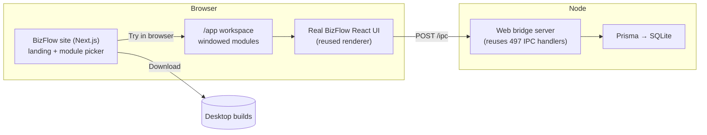

# BizFlow changes — what we built & why

This document records everything we changed to take **BizFlow** (a Windows
Electron desktop app) and make it:

1. **Run in the browser** — no Electron, no Docker, no streaming.
2. **Expose all 7 business modules** as live, try-before-you-download demos.
3. Power a **rebranded marketing site + in-browser workspace** (the former
   "Nebula" project) where a visitor can try any module, then download it.

Nothing in BizFlow's business logic was rewritten. We added an adapter layer
that swaps the transport (Electron IPC → HTTP) and reuses the real code.

---

## 1. The big picture



Two repos/folders are involved:

| Folder | Role |
| --- | --- |
| `apps/bizflow/` | The cloned BizFlow source (MIT). We added a `web/` adapter. |
| `apps/nebula/` | The marketing site + in-browser workspace, **rebranded to BizFlow**. |

---

## 2. Changes in `apps/bizflow/` (the app)

### 2.1 The web port adapter — `apps/bizflow/web/`

BizFlow is Electron = a React renderer + a Node backend joined by **IPC**
(`ipcRenderer.invoke(channel, …)` ⇄ `ipcMain.handle(channel, fn)`). We kept both
sides and replaced the wire with HTTP:

| File | Purpose |
| --- | --- |
| `web/shims/electron.browser.ts` | Browser `electron` shim — `ipcRenderer.invoke` → `POST /ipc`; `contextBridge` → assigns on `window`. |
| `web/shims/electron.node.ts` | Node `electron` shim — records `ipcMain.handle` handlers into a registry; stubs `app`, `BrowserWindow`, etc. |
| `web/shims/electron-log.*.ts` | Logging shims (browser → console, node → console). |
| `web/shims/electron-toolkit-preload.ts` | Shims `@electron-toolkit/preload`; routes `window.electron.ipcRenderer` through the same HTTP bridge. |
| `web/server.ts` | The bridge server: inits Prisma/SQLite, seeds the setup user, registers all handlers, serves `POST /ipc`. |
| `web/build-server.mjs` | esbuild bundler that aliases Electron modules to the Node shims, then runs the server. |
| `web/vite.web.config.ts` | Vite config that serves the real renderer, aliasing Electron modules to the browser shims; proxies `/ipc` → `:8787`. |
| `web/main-web.tsx`, `web/index.html` | Web entry point that runs the real preload then mounts the real `App`. |
| `web/web-polyfill.ts` | Provides a `process` global before the preload reads `process.contextIsolated`. |
| `web/README.md` | How the web port works + how to run/extend it. |

### 2.2 All 7 plugins enabled in the web port

Originally only **commerce** was wired in. We enabled every module:

- `web/server.ts` now calls `registerCommerceHandlers`, `registerBakeryHandlers`,
  `registerRestaurantHandlers`, `registerWarehouseHandlers`,
  `registerClinicHandlers`, `registerVetHandlers`, `registerGymHandlers`
  (plus `registerLogHandlers`).
- Plugin build flags set to `true` for all modules in **both**
  `web/build-server.mjs` and `web/vite.web.config.ts`
  (`__PLUGIN_COMMERCE__` … `__PLUGIN_GYM__`).

Result: registered IPC channels went from **212 → 497**, and every module's
pages render and fetch live data through the bridge.

### 2.3 New npm scripts — `apps/bizflow/package.json`

```jsonc
"web:setup":  "merge schemas + prisma db push (build the SQLite DB)",
"web:server": "node web/build-server.mjs",   // backend bridge on :8787
"web:client": "vite --config web/vite.web.config.ts" // UI on :5180
```

> One-time after `npm install`, also run
> `npx prisma generate --schema=prisma/merged.prisma` so the Prisma client
> includes every module's models.

### 2.4 What we did NOT change

- No business logic, services, repositories, handlers or React pages were
  modified. The adapter reuses them verbatim.
- The original Electron build path is untouched — the desktop app still builds
  exactly as before.

---

## 3. Changes in `nebula/` (the site → rebranded BizFlow)

### 3.1 Brand assets

- Copied BizFlow's logo + icon into `nebula/public/brand/`
  (`bizflow-icon.png`, `bizflow-logo.svg`).
- `globals.css`: replaced the purple "Nebula" palette with **BizFlow blues**
  (`--color-biz-*`, `#03bbfb → #0049b6`); recolored the text gradient, glow,
  scrollbar and aurora background.
- `layout.tsx`: title/description/keywords/favicon updated to BizFlow.

### 3.2 The module catalog — `nebula/src/lib/plugins.ts`

A single source of truth describing all 7 modules (name, tagline, description,
features, icon, accent, route, per-module download env). Helpers:

- `demoUrlFor(plugin)` → live demo URL (`<BIZFLOW_URL>#/<route>`).
- `downloadUrlFor(plugin)` → per-module download URL (env-overridable).

### 3.3 The marketing site

| Component | Change |
| --- | --- |
| `landing/Plugins.tsx` (new) | **The module picker** — a card per module with **Try in browser** and **Download** actions. The core of the experience. |
| `landing/Hero.tsx` | New BizFlow copy + a tile grid of the modules. |
| `landing/Nav.tsx`, `Footer.tsx` | BizFlow logo/name, real download link, "Modules" nav. |
| `landing/Features.tsx`, `Showcase.tsx` | Rewritten for BizFlow (POS, offline, modular, reports…). |
| `AuroraBackground.tsx`, `app/page.tsx` | Blue background; Plugins section added to the page. |

### 3.4 The in-browser workspace (`/app`)

| Component | Change |
| --- | --- |
| `desktop/ModuleFrame.tsx` (new) | Embeds the live BizFlow app for one module + a "Download" bar. |
| `lib/apps.tsx` | Dock is now **generated from the module catalog** (one app per module). |
| `desktop/Desktop.tsx` | Reads `/app?module=<id>` to auto-open a module; BizFlow-branded welcome screen. |
| `desktop/MenuBar.tsx` | BizFlow logo + "Workspace". |
| `desktop/Window.tsx` | Close-button color updated to the new palette. |
| Removed | Toy apps (Calculator, Notes, Terminal, About), the old `RemoteApp`, and the unused `/api/system` route. |

### 3.5 Config — `nebula/.env.example`

```
NEXT_PUBLIC_BIZFLOW_URL=http://localhost:5180/     # live web port the windows embed
NEXT_PUBLIC_DOWNLOAD_URL=…                          # default download link
NEXT_PUBLIC_DL_<MODULE>=…                           # optional per-module download URL
```

---

## 4. How to run the whole thing

```powershell
# From the repo root — install once, then run all three processes
npm install            # set ELECTRON_SKIP_BINARY_DOWNLOAD=1 the first time
npm run setup          # build the DB + Prisma client (one-time)
npm run dev            # bridge :8787 + BizFlow UI :5180 + Nebula site :3000
```

Then on the site: **Modules → Try in browser** opens `/app?module=<id>`, which
launches that module live in a window with a **Download** button.

---

## 5. Verified working

- Bridge registers **497** channels; auth, commerce, bakery, restaurant,
  warehouse, clinic, vet and gym channels all respond.
- Browser: landing hero + module picker render; `/app?module=clinic`
  auto-opens a live **Clinic** window running the real BizFlow app.
- `nebula` production build passes (`npm run build`).

---

## 6. Known issues & limitations

| Item | Notes |
| --- | --- |
| `dashboard:getMetrics` | BizFlow-internal bug — raw SQL references a `si.cost` column not in the current schema. Throws server-side; the UI falls back to `$0`. Not introduced by us. |
| Deep-link to a module route | After login BizFlow's router tends to land on the dashboard; the window's header still reflects the chosen module. Cosmetic. |
| Auth/session | The web port has no per-request auth — the renderer trusts the login response. Add real sessions/JWT before exposing publicly. |
| Concurrent users | Each browser session gets its **own isolated SQLite sandbox** (cloned from a seeded template), so simultaneous visitors never share or overwrite each other's data. For a shared multi-user product, move to a hosted DB (Postgres/MySQL) with tenant scoping. |
| Download links | Point at the GitHub releases page by default. Set `NEXT_PUBLIC_DL_<MODULE>` to ship per-module installers. |

---

## 7. How to add another module later

1. In `apps/bizflow/web/server.ts`: import and call its `register<Name>Handlers`.
2. Set its `__PLUGIN_<NAME>__` flag to `true` in `build-server.mjs` and
   `vite.web.config.ts`.
3. Add an entry to `apps/nebula/src/lib/plugins.ts` — it automatically appears in the
   site picker and the desktop dock.

---

## 8. Update — isolated demos, sales UI & custom requests

A second round added the "try one module, then buy / request custom" flow.

### 8.1 Single-module isolated demos

Previously, trying a module showed the whole app (every module's nav). Now each
demo is **scoped to just that module**.

- **How:** the embed URL carries `?only=<moduleId>`
  (`demoUrlFor()` in `apps/nebula/src/lib/plugins.ts`).
- The browser shim (`apps/bizflow/web/shims/electron.browser.ts`) forwards `only`
  with every `/ipc` call.
- The bridge (`apps/bizflow/web/server.ts`) **overrides `module:getEnabled`** to
  return only that module (plus `commerce` for modules that depend on it:
  restaurant, warehouse). BizFlow's own nav (`useModuleEnabled`) then hides
  everything else.
- Verified: `only=gym` → `["gym"]`; `only=restaurant` → `["commerce","restaurant"]`;
  no `only` → all 7 (full app).

### 8.2 Richer module catalog — `nebula/src/lib/plugins.ts`

Each module now carries `longDescription`, `highlights` (metric chips),
an expanded `features` list, `bestFor`, a one-time `price`, and an optional
`popular` flag.

### 8.3 Sales-oriented UI

| Component | What it does |
| --- | --- |
| `landing/Plugins.tsx` | Redesigned cards: highlight chips, full feature list, "best for", price, **Try free** + **Get it**, "Most popular" badge, suite/custom hooks. |
| `landing/Pricing.tsx` (new) | Three tiers — Single module / **Full suite** (auto-discounted) / Custom — plus a per-module price strip. |
| `landing/RequestForm.tsx` (new) | Guest request form with a **live price estimate**. |
| `landing/Nav.tsx`, `app/page.tsx` | Added Pricing + Custom nav links and mounted the new sections. |

### 8.4 Pricing model — `nebula/src/lib/pricing.ts`

A single `estimate()` function (used by both the form preview and the API) turns
{ type, module, complexity, rush, support } into a price range + breakdown + ETA.
`SUITE_PRICE` is the sum of module prices with a 40% bundle discount.

### 8.5 Request intake API — `nebula/src/app/api/requests/route.ts`

`POST /api/requests` validates input at the boundary, re-computes the estimate
server-side (so the quote can't be tampered with), stores the request in
`nebula/.data/requests.json` (git-ignored), and returns a reference + quote.
Swap the file store for email/CRM in production.

### 8.6 Request types supported

- **Update a module** — change/extend an existing module (priced by complexity).
- **New custom module** — a brand-new module for the visitor's business.
- **Full suite** — all modules at the bundle price.

### 8.7 Verified

- Module isolation confirmed at the bridge and in the embedded UI (Gym demo
  shows only Gym in its sidebar).
- `POST /api/requests` returns a ref + estimate; `nebula` production build passes
  with the new `/api/requests` route.

