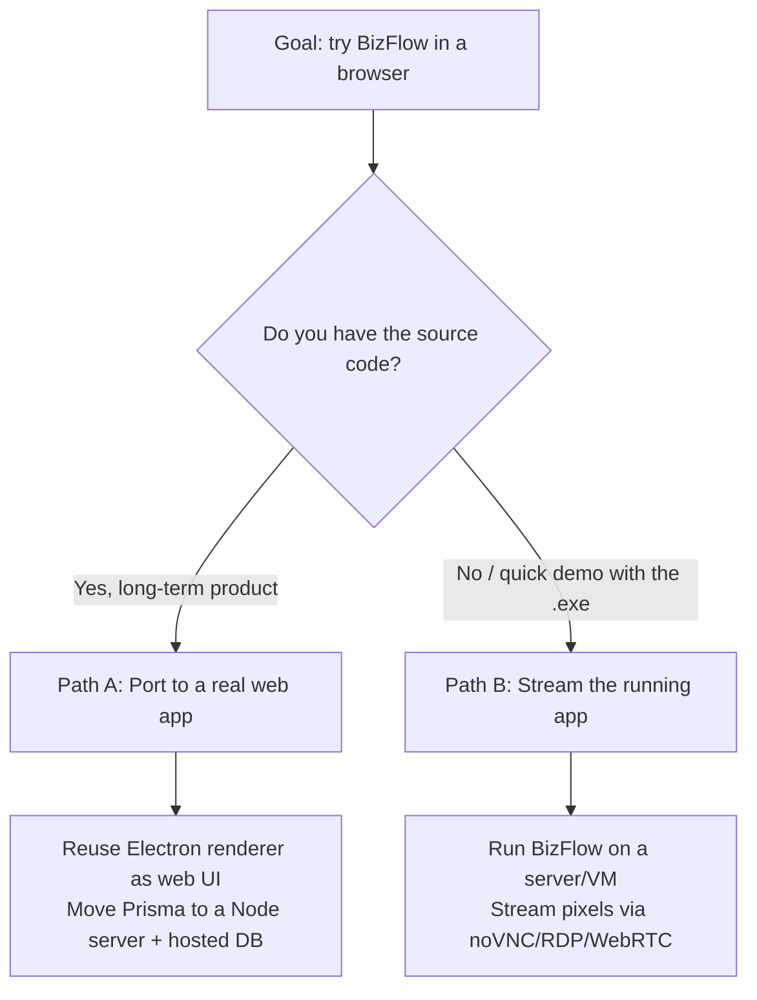

# Running BizFlow in the browser

This guide explains **how we let people try BizFlow (our desktop app) from a web
browser**, why the obvious approaches don't work, and the exact steps to make it
run. It is tailored to what BizFlow actually is.

> ✅ **We did it — the web port works.** BizFlow now runs in a normal browser
> tab (no Electron, no Docker, no streaming) by reusing its own React UI and
> backend over HTTP. Jump to the working setup:
> [../../bizflow/web/README.md](../../bizflow/web/README.md). The rest of this
> document explains the reasoning and the streaming alternative.

---

## 1. What BizFlow is (the facts)

We inspected `bizflow-1.0.0-commerce.exe` and confirmed:

| Property | Value |
| --- | --- |
| Size | ~215 MB |
| Installer type | **NSIS** (produced by `electron-builder`) |
| App runtime | **Electron** (Chromium + Node.js) — confirmed via `LICENSE.electron.txt`, `chrome_*.pak`, `v8_context_snapshot.bin` |
| Backend | **Prisma** (a Node.js ORM) found in `resources/app.asar.unpacked/prisma` → the app talks to a **database** |
| Source | Open-source (MIT), `github.com/medhatjachour/electron-app` — enabled the web port |
| Native run | ✅ Verified — installs to `%LOCALAPPDATA%\Programs\BizFlow` and launches (4 Electron processes) |

**Conclusion:** BizFlow is a full desktop application with a Node backend and a
database — *not* a static web page.

---

## 2. Why a browser tab can't run the `.exe` directly

A browser tab is a **security sandbox**. It can run JavaScript and WebAssembly,
but it is physically prevented from launching native Windows executables. There
is no API that lets a website execute `BizFlow.exe` on a visitor's machine — and
that's a good thing.

We also can't just "extract the HTML and serve it," because BizFlow's screens
talk to Electron's Node process and a Prisma **database**. A plain browser has
no Node, no filesystem and no database, so those screens would break.

So we have two honest ways to deliver "try it in the browser":



---

## 3. The three options at a glance

| Option | What happens | Pros | Cons | Best for |
| --- | --- | --- | --- | --- |
| **Native run** | Double-click `BizFlow.exe` on Windows | Trivial, full speed | Not in a browser | Verifying the app works |
| **Path B — Stream** | App runs on a server/VM; browser shows video + sends input | Works with just the `.exe`; no rewrite | Costs a live machine **per concurrent user**; latency; Electron-under-Wine is flaky | Interactive demos / "try before download" |
| **Path A — Web port** | Renderer becomes a real web app; Prisma moves to a server + hosted DB | Free to serve, infinitely scalable, best UX | Needs source code + dev work | The actual production commerce product |

> **Recommendation for a commerce product:** Path A is the real destination.
> Streaming every visitor their own desktop is expensive and is not how
> commerce SaaS is delivered. Use **Path B** for a quick interactive demo now,
> and plan **Path A** for production. See §7.

---

## 4. Prerequisite for streaming: Docker

Streaming needs a server runtime. On this machine **Docker is not yet
installed**, so install one of:

- **Docker Desktop for Windows** — <https://www.docker.com/products/docker-desktop/>
  (enables the WSL2 backend; a reboot is usually required).

Verify with:

```powershell
docker --version
docker compose version
```

---

## 5. Path B — Stream BizFlow to the browser

Everything is pre-wired in the [`streaming/`](../streaming) folder. The installer
has already been copied to `streaming/app/bizflow-1.0.0-commerce.exe`.

### 5a. Lightweight (Linux + Wine) — fastest to start

Runs BizFlow under Wine inside a Linux container and serves a noVNC web client.

```powershell
cd "D:\New folder\apps\nebula\streaming"
docker compose up --build
```

Then either open <http://localhost:6080/vnc.html> directly, or open Nebula
(`npm run dev`) → the **BizFlow** icon in the dock.

> ⚠️ **Electron + Wine caveat:** BizFlow bundles Chromium *and* native Prisma
> binaries. Wine can struggle with these. The container already passes
> `--no-sandbox`. If BizFlow won't start or render correctly, use 5b instead.

### 5b. Full compatibility (real Windows) — most reliable for BizFlow

Because BizFlow is a Windows Electron app, running it on **real Windows** is the
most dependable. Use the bundled compose file:

```powershell
cd "D:\New folder\apps\nebula\streaming"
docker compose -f docker-compose.windows.yml up
```

1. Open <http://localhost:8006> — Windows installs automatically (first run is slow).
2. Inside that Windows, run the BizFlow installer (it's shared into `./shared`).
3. Set `NEXT_PUBLIC_STREAM_URL=http://localhost:8006` (see `.env.example`).

> This image needs **KVM** (`/dev/kvm`). That requires a Linux host or a cloud VM
> with nested virtualization — it does **not** work on Docker Desktop for
> Windows. For a Windows-only machine, instead stream from a real/cloud Windows
> box using a VNC/RDP server + noVNC (same idea, Windows host).

### 5c. Point Nebula at the stream

```powershell
Copy-Item .env.example .env.local   # then edit NEXT_PUBLIC_STREAM_URL if needed
```

The **BizFlow** window in Nebula's dock embeds whatever `NEXT_PUBLIC_STREAM_URL`
points to.

---

## 6. Security checklist (before exposing beyond localhost)

- [ ] Set `VNC_PASSWORD` in `streaming/docker-compose.yml` — never run open VNC publicly.
- [ ] Put the stream behind **HTTPS** and authentication (reverse proxy / your app's login).
- [ ] Give each session its **own** container — a single shared container means every visitor sees the same screen.
- [ ] Apply **CPU/RAM limits** and idle timeouts so one user can't exhaust the host.
- [ ] Never expose raw VNC (5900) or RDP (3389) directly to the internet.

---

## 7. Scaling: from one demo to many users

A single container serves **one** shared session. For many simultaneous users,
each needs an isolated instance — that means orchestration and real cost.

- **Kasm Workspaces** — purpose-built for streaming containerized apps/desktops per user.
- **Apache Guacamole** — clientless RDP/VNC gateway, good for Windows hosts.
- **Selkies / Neko (WebRTC)** — lower latency, GPU streaming.

This is why, for a commerce product, **Path A (web port)** is the long-term win.

---

## 8. Recommended long-term: port BizFlow to a real web app (Path A)

BizFlow's renderer is already web technology (Electron = Chromium). The work is:

1. **Reuse the renderer** (the React/HTML/CSS UI) as the web front end.
2. **Replace Electron IPC + Prisma-in-the-app** with a **Node API server** and a
   **hosted database** (Postgres/MySQL). Prisma runs great on a server.
3. **Host it** as a normal website — free to serve, scalable, no streaming.

**Good news:** this Nebula project (Next.js + Node API routes) is already the
ideal shell for that web version. The same `src/app/api/*` backend pattern can
host BizFlow's Prisma models, and BizFlow's screens become Nebula apps/pages.

---

## 9. Troubleshooting

| Symptom | Fix |
| --- | --- |
| `docker: command not found` | Install Docker (see §4), reopen the terminal. |
| BizFlow window blank in Nebula | The stream container isn't running, or `NEXT_PUBLIC_STREAM_URL` is wrong. Start §5, check <http://localhost:6080/vnc.html>. |
| Electron won't start under Wine | Use the real-Windows path (5b). |
| Black screen / GPU errors | The container already uses `--disable-gpu`; ensure `shm_size` is set (it is). |
| App installs but DB errors | BizFlow's Prisma DB needs a writable path; on real Windows this just works. |

---

## 10. Verifying it runs

- **Native (works today):** `& "$env:LOCALAPPDATA\Programs\BizFlow\BizFlow.exe"` → app window opens.
- **Browser (after Docker):** `cd streaming; docker compose up --build` → open <http://localhost:6080/vnc.html> or Nebula's **BizFlow** dock icon.
