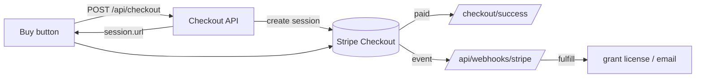

# Stripe payments — setup & what to add later

This document explains the payment system that's wired into the BizFlow site,
how to turn it on, and the **TODO list** of things you still need to add before
taking real money.

> The code is built so the site **works today without any Stripe keys** — the
> Buy buttons fall back to the download link. Add the keys below to switch on
> real checkout.

---

## 1. What's already built

| Piece | File | Purpose |
| --- | --- | --- |
| Stripe client | `src/lib/stripe.ts` | Lazily creates the Stripe SDK; returns `null` if no key (safe fallback). |
| Item catalog | `src/lib/payments.ts` | Maps `module:<id>` / `suite` → label + price (from the shared catalog). |
| Checkout API | `src/app/api/checkout/route.ts` | `POST` creates a Stripe Checkout session, returns its URL. |
| Webhook | `src/app/api/webhooks/stripe/route.ts` | Verifies signature, fulfills `checkout.session.completed`. |
| Buy button | `src/components/BuyButton.tsx` | Starts checkout; falls back to download if payments are off. |
| Success page | `src/app/checkout/success/page.tsx` | Post-payment confirmation. |
| Cancel page | `src/app/checkout/cancel/page.tsx` | Shown if the user backs out. |

Flow:



Prices come from one place — each module's `price` in `src/lib/plugins.ts` and
`SUITE_PRICE` in `src/lib/pricing.ts` — so the card, the checkout and the charge
always match.

---

## 2. Turn it on (test mode)

### 2.1 Create a Stripe account & get keys
1. Sign up at <https://dashboard.stripe.com>.
2. Copy your **test** secret key (`sk_test_…`) from Developers → API keys.

### 2.2 Add environment variables
Copy `.env.example` to `.env.local` and set:

```bash
NEXT_PUBLIC_SITE_URL=http://localhost:3000
STRIPE_SECRET_KEY=sk_test_xxx
# Webhook secret — from step 2.3
STRIPE_WEBHOOK_SECRET=whsec_xxx

# License key signing secret (any long random string). The webhook and the
# success page both derive the same key from this, so keep it stable in prod.
LICENSE_SECRET=change-me-to-a-long-random-string

# Direct-download base for installers published by the release pipeline, e.g.
# a GitHub "releases/latest/download" URL. When unset, download links fall back
# to the releases page so they never 404.
NEXT_PUBLIC_DOWNLOAD_BASE=https://github.com/<owner>/<repo>/releases/latest/download
```

### 2.3 Forward webhooks locally
Install the [Stripe CLI](https://stripe.com/docs/stripe-cli), then:

```bash
stripe login
stripe listen --forward-to localhost:3000/api/webhooks/stripe
```

The CLI prints a `whsec_…` secret — put it in `STRIPE_WEBHOOK_SECRET`.

### 2.4 Test a purchase
1. `npm run dev`
2. On the site, click **Buy** on a module (or **Get the full suite**).
3. Use Stripe's test card: `4242 4242 4242 4242`, any future expiry, any CVC.
4. You land on `/checkout/success`; the `stripe listen` terminal shows the
   `checkout.session.completed` event and the server logs the fulfillment +
   writes `.data/orders.json`.

---

## 3. TODO — what you still need to add

### 3.1 Fulfillment (most important)
Right now `fulfill()` in `src/app/api/webhooks/stripe/route.ts` only logs the
order and appends to `.data/orders.json`. Replace the `// TODO` with real
fulfillment:
- [ ] Generate/store a **license key** for the purchased item.
- [ ] **Email** the customer their receipt + download link / license.
- [ ] Optionally create a customer **account** and grant module access.
- [ ] Persist orders in a real **database** (not the local JSON file).

### 3.2 Email
- [ ] Add an email provider (Resend, Postmark, SendGrid, or Stripe's built-in
      receipts). Send the license + download link from `fulfill()`.
- [ ] Turn on Stripe **email receipts** (Dashboard → Settings → Customer emails)
      for a quick start.

### 3.3 Download protection
- [ ] The download links in `src/lib/plugins.ts` are currently public. Gate them
      behind a purchased license (signed URL or token checked on download).

### 3.4 Prices & products
- [ ] Decide: keep **dynamic prices** (current — amount sent per checkout) or
      create **Products/Prices** in the Stripe Dashboard and set the
      `STRIPE_PRICE_*` env vars (more reporting, coupons, easier price changes).
- [ ] Confirm final prices in `src/lib/plugins.ts` / `pricing.ts`.

### 3.5 Tax, currency & compliance
- [ ] Enable **Stripe Tax** (or set tax rates) if you must collect VAT/sales tax.
- [ ] Confirm `STRIPE_CURRENCY` (default `usd`).
- [ ] Add **Terms of Service**, **Refund** and **Privacy** pages and link them.

### 3.6 Go live
- [ ] Swap test keys for **live** keys (`sk_live_…`).
- [ ] Create a **live webhook endpoint** in the Dashboard
      (`https://yourdomain.com/api/webhooks/stripe`) and use its `whsec_…`.
- [ ] Set `NEXT_PUBLIC_SITE_URL` to your production domain.
- [ ] Keep `STRIPE_SECRET_KEY` / `STRIPE_WEBHOOK_SECRET` **server-side only**
      (never `NEXT_PUBLIC_…`). Add them in your host's secret manager.
- [ ] Test the full flow once in live mode with a real card.

### 3.7 Nice-to-haves
- [ ] Order history / receipts page for customers.
- [ ] Discount codes (checkout already passes `allow_promotion_codes: true`).
- [ ] Handle `charge.refunded` / disputes in the webhook.
- [ ] Rate-limit `POST /api/checkout`.

---

## 4. How money maps to items

| Item id | What it is | Amount |
| --- | --- | --- |
| `module:commerce` … `module:gym` | One module license | that module's `price` × 100 (cents) |
| `suite` | All modules | `SUITE_PRICE` × 100 (cents) |

Change a price in `src/lib/plugins.ts` (per module) or the discount in
`src/lib/pricing.ts` (suite) and everything updates — card, checkout and charge.

---

## 5. Security notes

- Secret key and webhook secret are **server-only**; they are never exposed to
  the browser.
- The charged amount is computed **server-side** from the catalog — the client
  only sends an item id, so prices can't be tampered with.
- The webhook **verifies the Stripe signature** before trusting any event and
  reads the raw request body (required for verification).
- Never commit `.env.local` (already git-ignored). `.data/` (orders/requests) is
  git-ignored too.

---

## 6. License keys & downloads

After a successful payment the customer lands on `/checkout/success`, which:

1. Retrieves the Stripe session and confirms `payment_status === "paid"`.
2. Derives a **license key** with `licenseKeyFor()` (`src/lib/license.ts`) — an
   HMAC of `sessionId | itemId | email` signed with `LICENSE_SECRET`, formatted
   as `BIZ-XXXXX-XXXXX-XXXXX-XXXXX`.
3. Shows the key (copy button) and **OS-aware download buttons** for every
   module the customer bought (the suite shows all modules).

The key is **deterministic**, so the webhook (`src/app/api/webhooks/stripe/route.ts`)
computes the *same* value during fulfillment and records it in `.data/orders.json`
— no database needed. Use `verifyLicenseKey()` to validate a key offline inside
the desktop app (Settings → License).

> ⚠️ Keep `LICENSE_SECRET` stable and identical wherever you verify keys. If it
> changes, previously issued keys stop verifying.

### 6.1 Per-OS release pipeline

`apps/bizflow/.github/workflows/release-all-os.yml` builds BizFlow for Windows,
macOS and Linux on a `v*.*.*` tag and publishes installers to a GitHub Release
named to match `installerFor` in `src/lib/downloads.ts`
(`BizFlow-<Slug>-<os>.<ext>`). Point the site at it:

```bash
NEXT_PUBLIC_DOWNLOAD_BASE=https://github.com/<owner>/<repo>/releases/latest/download
```

Today one binary contains every module (isolation is via `?only=<id>`), so the
workflow builds once per OS and publishes that installer under the `Suite` name
and a copy per module so every website link resolves. When real per-module
installers exist, replace the copy loop with per-module build targets.

