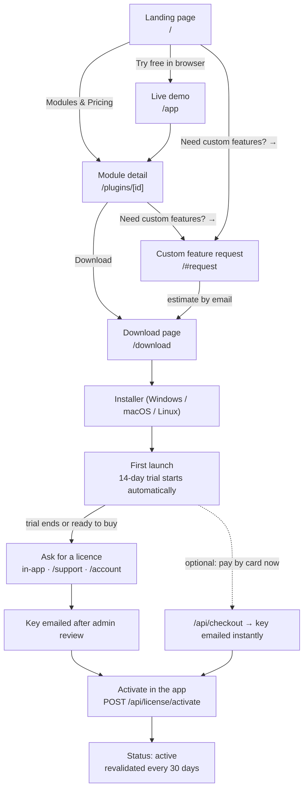

# BizFlow customer journey — website, demo, trial and licence

This document describes the path a new customer actually walks, end to end, and
names the URL, endpoint and app state at every step so the journey can be
verified rather than described.

The promise the whole flow is built around:

> **Try the full app in a browser, download it and work for 14 days, then ask
> for a licence key when you are ready. No card, no pre-sales, no sales call —
> at any step.**

Everything below is implemented; `apps/website/tests/user-flow.test.ts` asserts
the parts that are easy to break by accident (the demo-first entry point, the
trial copy, the absence of a required checkout, the licence states).

## The journey at a glance



Nothing in the solid arrows requires a payment method, an account, or a
conversation with a human before the software is running on the customer's
machine.

## Stage by stage

| # | Stage | Where | What the customer sees | What backs it |
|---|-------|-------|------------------------|---------------|
| 0 | Land | `/` | Hero offers three entries: **Try free in browser**, *Modules & Pricing*, *Need custom features?* | `components/landing/Hero.tsx` |
| 1 | Try the demo | `/app` | The **full desktop app in the browser** with demo data — the real UI, not screenshots | `app/app/page.tsx` → `components/desktop/Desktop` |
| 2 | Evaluate a module | `/plugins/[id]`, `#plugins` | What the module includes, plus the shared back office (HR, finance, expenses, reports, roles) | `components/landing/Plugins.tsx` |
| 3 | Decide about custom features | `/#request` | Request form with a **live itemised estimate** (scope, complexity, rush, support) and an ETA | `components/landing/RequestForm.tsx` → `POST /api/requests` |
| 4 | Download | `/download` | Pick module + OS (`windows` / `mac` / `linux`), installer starts. Deep links: `/download?module=<id>&os=<os>&autoStart=1` | `app/api/download/route.ts` |
| 5 | First launch | Desktop app | *"First launch starts a 14-day free trial. No licence key needed yet."* Trial clock is created and mirrored on first run | `main/ipc/handlers/license.handlers.ts` (`TRIAL_PERIOD_MS`) |
| 6 | Work normally | Desktop app | The whole product is usable; the only difference is the trial counter | licence status `trial` |
| 7 | Ask for a licence | In-app licence screen · `/support` · `/account` | Customer sends name, business, requested module; the app attaches device name and fingerprint automatically | `POST /api/license/request` (rate limited 8/h per IP) |
| 8 | Key issued | Email | An admin reviews the request in `/admin` and mints a `BIZ-…` key; the key is emailed | `app/api/admin/licenses` |
| 9 | Activate | Desktop app | Paste the email + key → device is bound to the licence | `POST /api/license/activate` |
| 10 | Stay activated | Desktop app | Status `active`; the app silently revalidates with `POST /api/license/validate` | see the states below |

### Optional accelerator, not a required step

Payment by card exists (`POST /api/checkout` → Stripe → `POST /api/webhooks/stripe`
mints the key immediately) for a customer who does **not** want to wait for an
admin. It is a shortcut on the arrow marked *optional* in the diagram: skipping
it changes the delivery time of the key, not the ability to run the software.

There is deliberately **no `/checkout` page in the free path** — in fact there is
no `app/checkout/page.tsx` at all, only `checkout/success` and `checkout/cancel`,
so no visitor can be pushed into a payment form while browsing. The load harness
records this as `GET /checkout → 404` so that adding a page there is noticed.

## Licence states the customer can be in

The desktop app is the source of truth for its own device; the server is only
consulted for activation and revalidation.

| Status | Meaning | Recovery |
|--------|---------|----------|
| `trial` | Inside the 14-day window since first launch on this device | Nothing to do |
| `trial_expired` | 14 days are up, no key activated yet | Request a licence, then activate |
| `active` | Key activated and the last revalidation is inside the 30-day window | Automatic |
| `grace` | A revalidation was due and the machine was offline | Works for up to 14 days, warns, retries every 6 h |
| `expired` | Missed revalidation beyond the grace period, or the server said `valid:false` | Reconnect, or contact support |

Revalidation details, so an offline shop is never locked out by accident:

- **Interval:** 30 days from the last successful check.
- **Sweep:** a running app re-checks the due date every 6 hours (cheap when it is
  not due), instead of only once per app start.
- **Lead:** checks start 3 days early, and every success rolls the window
  forward, so a daily user is always refreshed long before grace.
- **Grace:** 14 days of full function after a missed check.
- **Tolerance:** three consecutive `valid:false` answers are needed before the
  local activation is cleared, so a transient server hiccup cannot wipe a paying
  customer's licence.
- **Clock tampering:** a high-water mark is persisted hourly, so winding the
  system clock back does not extend the trial or skip revalidation.
- **Moving device:** the licence binds one device at a time; a device-transfer
  request binds the new fingerprint to the same key.

## Measuring this journey

The `user-journey` scenario in the load harness (`scripts/perf/scenarios.mjs`)
replays exactly the eight requests in stages 0-7 plus activation:

```
landing → demo → module → pricing → download → support → activate → account
```

Its reported p95 is literally "how long the whole journey takes a real visitor",
and each step is reported separately so a slow step is attributable. See
[PERFORMANCE_TESTING.md](./PERFORMANCE_TESTING.md) for the harness and the
measured numbers.
